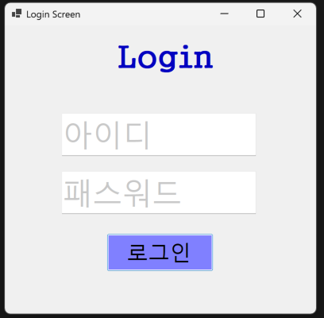
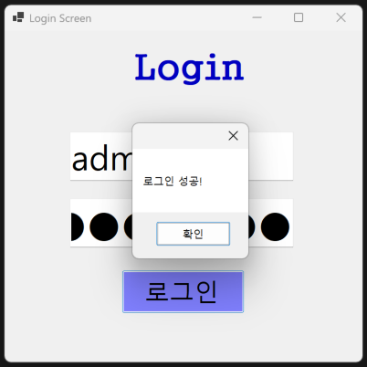
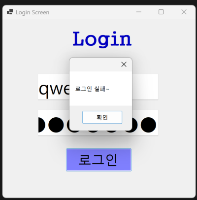
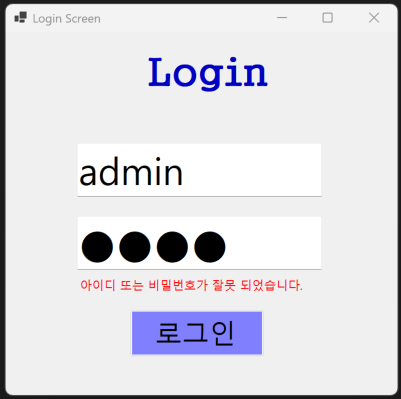

# (C# 코딩) 로그인 스크린
## 개요
- C# 프로그래밍 학습
- 1줄 소개: 사용자의 아이디와 패스워드를 입력받는 로그인 프로그램
- 사용한 플랫폼:
  - C#, .NET Windows Forms, Visual Studio, GitHub
- 사용한 컨트롤:
  - Label, TextBox, Button
- 사용한 기술과 구현한 기능:
  - Visual Studio를 이용하여 UI 디자인
  - placeholder 기능 구현
  - 패스워드 입력 내용을 숨기는 기능 구현
  - 탭을 이용한 입력 포커스 제어

  ## 실행 화면 (과제1)
- 과제1 코드의 실행 스크린샷

- 과제 내용
	- Label(표시), TextBox(입력), Button(전송)을 적절히 배치함.
	- TExtBox에 placeholder 기능 구현함.
	- 아이디와 패스워드 입력 받아 확인함.

- 구현 내용과 기능 설명
	- 처음 실행시 입력 포커스가 버튼으로 가도록 조정.
	- 아이디와 패스워드를 입력 받는 창에 안내 문구가 표시되도록 구현.

## 실행 화면 (과제2)
- 과제2 코드의 실행 스크린샷

- 과제 내용
	- 로그인 실패 시 MessageBox 대신 비밀번호 입력창 아래에 에러 메시지를 표시.
	- Label 컨트롤을 추가하여 오류 메시지를 출력.
	- Label의 Visible 속성을 사용하여 평소에는 숨기고, 로그인 실패 시 보이도록 구현함.

- 구현 내용과 기능 설명
	- 로그인에 성공하면 에러 메시지 Label은 보이지 않도록 설정함.
	- 로그인에 실패하면 "아이디 또는 비밀번호가 잘못 되었습니다." 문구가 화면에 표시되도록함.
	- 기존 과제1에서 사용한 로그인 화면을 유지하면서, 실패 알림 방식을 MessageBox에서 화면 표시 방식으로 변경.